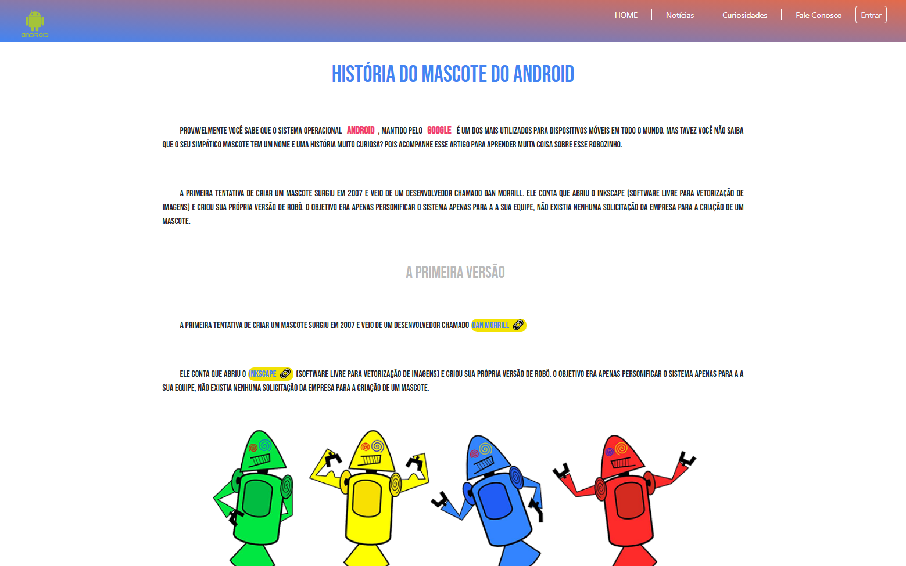

# Curiosidades de Tecnologia Android: Uma Viagem Interativa no Tempo 🚀

Os Bugdroids são os icônicos mascotes verdes do Android, criados por Irina Blok. Seu design simples e aberto permite a customização, simbolizando a filosofia de código aberto e amigável do sistema. Rapidamente se tornaram sinônimo do Android, representando a marca globalmente.
Além de serem visualmente atraentes, os Bugdroids também personificam a filosofia de abertura e customização do Android, convidando usuários e desenvolvedores a se sentirem parte da comunidade.

### ✨ Mergulhe em uma experiência única e descubra os segredos do robozinho mais famoso do mundo! ✨

Clique no botão abaixo para acessar:

   

---

### Conteúdo Exclusivo:

*   **Uma Linha do Tempo Animada:** Veja a evolução do Android, desde o seu nascimento até as versões mais recentes, com efeitos visuais incríveis. (JavaScript powered!) ⏳  [Explore a Linha do Tempo!](#linha-do-tempo)
*   **O Mascote em Detalhes:** Explore a história do Bugdroid, desde os primeiros rascunhos até o design final, com curiosidades e informações que você nunca imaginou. 🤖  [Descubra o Bugdroid!](#bugdroid)
*   **Os Doces Secretos:** Descubra o significado por trás dos nomes das versões do Android, com um quiz divertido para testar seus conhecimentos. 🍬  [Faça o Quiz dos Doces!](#quiz-doces)
*   **Bastidores da Criação:** Veja fotos e vídeos exclusivos dos criadores do Android, com entrevistas e depoimentos emocionantes. 🎥  [Veja os Bastidores!](#bastidores)
*   **E muito mais!** Prepare-se para se surpreender a cada clique. 😉

---

### Tecnologias Utilizadas:

*   HTML5: A base da nossa aventura, garantindo uma experiência rica e acessível.
*   CSS3: Estilização para tornar o projeto mais atraente.
*   Bootstrap 4: Design responsivo e elegante para todos os dispositivos.
*   Font Awesome: Ícones incríveis para uma navegação intuitiva.
*   DevIcons: Uma Biblioteca de ícones personalizados, para você estilizar o seu projeto.

---

### Como Desvendar os Segredos do Código:

Para executar este projeto localmente, siga estas etapas:

1.  Clone o repositório: `git clone [URL do seu repositório]`
2.  Navegue até o diretório do projeto: `cd seu-projeto`
3.  Abra o arquivo `index.html` no seu navegador.

**Observação:** Certifique-se de ter um navegador moderno com suporte a JavaScript habilitado.

---

### Quer Fazer Parte da História?

Siga estas etapas e ajude-nos a tornar este projeto ainda mais incrível:

1.  Faça um fork deste repositório.
2.  Crie um branch com sua feature: `git checkout -b minha-nova-feature`
3.  Faça commit das suas mudanças: `git commit -m 'Adiciona minha nova feature'`
4.  Faça push para o branch: `git push origin minha-nova-feature`
5.  Abra um pull request.

Consulte o guia [CONTRIBUTING.md](https://github.com/seu-usuario/seu-projeto/blob/main/CONTRIBUTING.md) para mais detalhes.

---

### Nossos Heróis (Colaboradores):

*   [DomisDev](https://github.com/DomisDev)
*   (Adicione outros colaboradores aqui)

---

### Perguntas Mais Frequentes (FAQ):

*   **Onde encontro a página mágica?** [Clique aqui!]([URL da sua página GitHub Pages])
*   **Como posso me juntar à aventura?** Consulte o guia [CONTRIBUTING.md](https://github.com/seu-usuario/seu-projeto/blob/main/CONTRIBUTING.md)
*   **Qual é o segredo da licença?** MIT - Sinta-se à vontade para usar e compartilhar!

---

### Próximos Desafios:

*   🗺️ Adicionar um mapa interativo mostrando a origem do Android.
*   💬 Implementar um sistema de comentários para cada versão do Android.
*   🎨 Melhorar a interface do usuário com novas animações e efeitos visuais.
*   🕹️ Criar um jogo interativo relacionado à história do Android.

---

### Seções Interativas (Exemplos):

#### Linha do Tempo do Android ⏳

(Aqui você adicionaria a lógica real para exibir a linha do tempo interativa.  Em um README estático, isso seria apenas um placeholder. No seu projeto, isso seria implementado com JavaScript e manipulação do DOM.)

#### A História do Bugdroid 🤖

(Similarmente, aqui você colocaria informações e possivelmente elementos interativos relacionados ao Bugdroid.)

#### Quiz dos Doces 🍬

(Aqui você incluiria o código ou links para o quiz.)

#### Bastidores da Criação 🎥

(Links para vídeos, fotos, etc.)

---

### Licença:

Este projeto está sob a proteção da Licença MIT. Use com sabedoria e compartilhe a alegria!

---

Feito com paixão e curiosidade por [DomisDev]! ✨